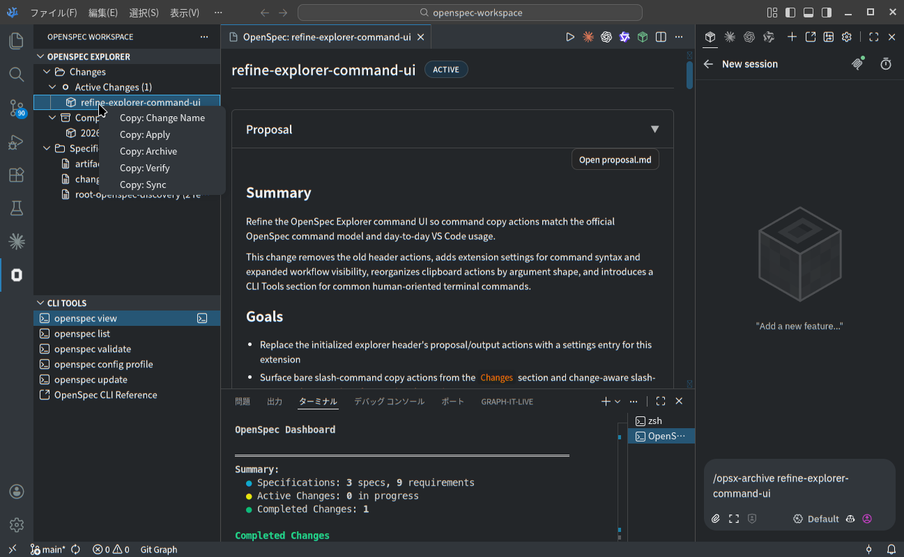

# OpenSpec Workspace

[](https://github.com/oioi555/openspec-workspace/releases)
[](LICENSE)
[](https://code.visualstudio.com/)


OpenSpec Workspace is a VS Code extension for spec-driven development.

> Unofficial extension.

- Browse OpenSpec changes and specs from a dedicated explorer in the Activity Bar
- Copy the right OpenSpec slash command for the current explorer context
- Optionally launch curated OpenSpec CLI commands from a separate `CLI Tools` view



_Current OpenSpec Explorer and CLI Tools preview with active/completed changes, contextual copy actions, and the details webview._

## What you get

- `OpenSpec Explorer` with `Changes`, `Active Changes`, `Completed Changes`, and `Specifications`
- Explorer header controls for opening extension settings and refreshing the view state
- Change details webview for reading `proposal.md`, `design.md`, `tasks.md`, and spec files
- Contextual copy actions:
  - `Changes` root for argument-less commands such as `propose` and `explore`
  - active changes for change-name-aware commands such as `apply`, `archive`, and optional expanded workflow actions
  - completed changes for copying the archived change name only

## Command syntax

Copied slash commands support two syntax styles:

- `Default`: `/opsx-apply my-change`
- `Claude Code`: `/opsx:apply my-change`

Change the `openspecWorkspace.commandSyntax` setting in VS Code to switch styles. If you leave it unchanged, the extension uses the `Default` syntax.

## Workflow

1. Plan the change with your preferred assistant.
2. Create or update OpenSpec artifacts.
3. Use the `Changes` root when you want an argument-less command such as `/opsx-propose` or `/opsx-explore`.
4. Right-click an active change when you want a change-name-aware command such as `/opsx-apply my-change` or `/opsx-archive my-change`.
5. Paste the copied command into the OpenSpec-supported AI assistant tool you use (TUI, VS Code extension, etc.) and run it there.

## Prerequisites

- VS Code `^1.74.0`
- An OpenSpec-initialized workspace (or run `openspec init`)
- `openspec` available in your terminal

## Install

GitHub Releases are the canonical source for downloadable `.vsix` packages:

- https://github.com/oioi555/openspec-workspace/releases

Install a downloaded `.vsix` in VS Code or another compatible editor by either:

1. Running `Extensions: Install from VSIX...` from the Command Palette and selecting the downloaded file.
2. Using the CLI:

```bash
code --install-extension ./openspec-workspace-<version>.vsix
```

## Quickstart

1. Open a folder that contains `openspec/` at the workspace root.
2. Open `OpenSpec Explorer` from the Activity Bar.
3. Optionally open the explorer settings and choose `Default` or `Claude Code` command syntax.
4. Use the `Changes` root or an active change context menu to copy the command you need.
5. Select a change or spec to open its details in the webview.
6. Optionally use `CLI Tools` for quick access to common `openspec` terminal commands when you want raw CLI access.

## Help / troubleshooting

- Logs: VS Code Output panel -> `OpenSpec Extension`
- OpenSpec upstream: https://github.com/Fission-AI/OpenSpec

## Development

Install deps and build:

```bash
npm install
npm run compile
```

Package a VSIX locally (the same path used for GitHub Release assets):

```bash
npm run package:vsix
```

## Special Thanks

- Fork origin: https://github.com/AngDrew/openspec-vscode

More:

- Release notes: `CHANGELOG.md`
- Contributing: `CONTRIBUTING.md`
- License: `LICENSE`
